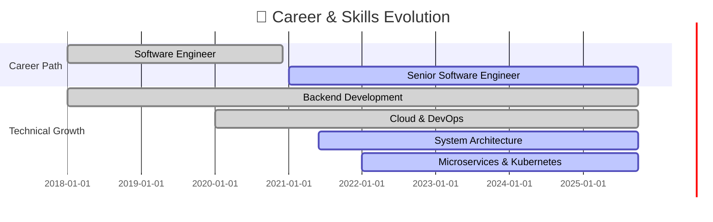

<div align="center">

<!-- Animated Header with Gradient -->


<!-- Dynamic Typing Animation -->
<a href="https://git.io/typing-svg">
  
</a>

<br/>

<!-- Animated Social Badges -->
<p align="center">
  <a href="https://sarvarunajvm.github.io/port-react-folio/">
    
  </a>
  <a href="mailto:sarvaruna@outlook.com">
    
  </a>
  <a href="https://www.linkedin.com/in/saravanan-kalimuthu-01a0a9113">
    
  </a>
  <a href="https://twitter.com/persianandro">
    
  </a>
  <a href="https://dev.to/sarvarunajvm">
    
  </a>
</p>

<!-- Enhanced Analytics Badges -->
<p align="center">
  
  
  
  
</p>

</div>

---

## 🎯 About Me

<div align="center">
  
</div>

<br/>

```typescript
class SeniorSoftwareEngineer {
  constructor() {
    this.name = "Saravanan Kalimuthu";
    this.role = "Senior Software Engineer";
    this.location = "🌍 Earth";
    this.workingOn = "Building scalable cloud-native systems";
    this.contactMe = "sarvaruna@outlook.com";
  }

  get skills() {
    return {
      languages: ["Java", "JavaScript", "TypeScript", "Go", "Python"],
      backend: ["Spring Boot", "Node.js", "Microservices", "REST APIs", "GraphQL"],
      frontend: ["Vue.js", "React", "HTML5", "CSS3", "Tailwind"],
      databases: ["PostgreSQL", "MongoDB", "Redis", "SQLite"],
      devOps: ["Docker", "Kubernetes", "AWS", "GCP", "Jenkins", "GitHub Actions"],
      architecture: ["Clean Architecture", "DDD", "Event-Driven", "CQRS"],
      tools: ["Git", "Gradle", "Maven", "Nginx", "Kafka", "Prometheus", "Grafana"]
    };
  }

  get currentFocus() {
    return {
      learning: ["Kubernetes", "Cloud Native Patterns", "System Design", "DevSecOps"],
      building: ["Scalable Microservices", "Developer Tools", "Open Source Projects"],
      writing: ["Technical Blogs", "Documentation", "System Design Articles"]
    };
  }

  get openSource() {
    return {
      maintaining: ["gem-of-config", "gem-of-view"],
      contributing: "Actively contributing to developer tools and frameworks",
      philosophy: "Code, Learn, Build, Share, Repeat 🔄"
    };
  }

  get achievements() {
    return [
      "🏆 8+ years of professional software engineering",
      "🌟 Active open source maintainer & contributor",
      "📝 Technical writer & knowledge sharing enthusiast",
      "🚀 Built production-grade applications serving thousands",
      "💡 Passionate about clean code & best practices"
    ];
  }
}

const saravanan = new SeniorSoftwareEngineer();
console.log(saravanan.skills.languages); // ["Java", "JavaScript", "TypeScript", "Go", "Python"]
```

---

## 🛠️ Tech Stack & Skills

<div align="center">

### 💼 Core Technologies

<table>
<tr>
  <td align="center" width="100">
    
    <br><strong>Java</strong>
  </td>
  <td align="center" width="100">
    
    <br><strong>Spring</strong>
  </td>
  <td align="center" width="100">
    
    <br><strong>JavaScript</strong>
  </td>
  <td align="center" width="100">
    
    <br><strong>TypeScript</strong>
  </td>
  <td align="center" width="100">
    
    <br><strong>Vue.js</strong>
  </td>
  <td align="center" width="100">
    
    <br><strong>Docker</strong>
  </td>
  <td align="center" width="100">
    
    <br><strong>Kubernetes</strong>
  </td>
  <td align="center" width="100">
    
    <br><strong>AWS</strong>
  </td>
</tr>
<tr>
  <td align="center" width="100">
    
    <br><strong>PostgreSQL</strong>
  </td>
  <td align="center" width="100">
    
    <br><strong>MongoDB</strong>
  </td>
  <td align="center" width="100">
    
    <br><strong>Redis</strong>
  </td>
  <td align="center" width="100">
    
    <br><strong>GitHub</strong>
  </td>
  <td align="center" width="100">
    
    <br><strong>GitLab</strong>
  </td>
  <td align="center" width="100">
    
    <br><strong>Node.js</strong>
  </td>
  <td align="center" width="100">
    
    <br><strong>Go</strong>
  </td>
  <td align="center" width="100">
    
    <br><strong>Python</strong>
  </td>
</tr>
</table>

### 🚀 DevOps & Cloud

<table>
<tr>
  <td align="center" width="100">
    
    <br><strong>Nginx</strong>
  </td>
  <td align="center" width="100">
    
    <br><strong>Kafka</strong>
  </td>
  <td align="center" width="100">
    
    <br><strong>Jenkins</strong>
  </td>
  <td align="center" width="100">
    
    <br><strong>Actions</strong>
  </td>
  <td align="center" width="100">
    
    <br><strong>Grafana</strong>
  </td>
  <td align="center" width="100">
    
    <br><strong>Prometheus</strong>
  </td>
  <td align="center" width="100">
    
    <br><strong>GCP</strong>
  </td>
  <td align="center" width="100">
    
    <br><strong>Terraform</strong>
  </td>
</tr>
</table>

### 🎨 Frontend & Tools

<table>
<tr>
  <td align="center" width="100">
    
    <br><strong>React</strong>
  </td>
  <td align="center" width="100">
    
    <br><strong>HTML5</strong>
  </td>
  <td align="center" width="100">
    
    <br><strong>CSS3</strong>
  </td>
  <td align="center" width="100">
    
    <br><strong>Sass</strong>
  </td>
  <td align="center" width="100">
    
    <br><strong>Tailwind</strong>
  </td>
  <td align="center" width="100">
    
    <br><strong>VS Code</strong>
  </td>
  <td align="center" width="100">
    
    <br><strong>IntelliJ</strong>
  </td>
  <td align="center" width="100">
    
    <br><strong>GraphQL</strong>
  </td>
</tr>
</table>

</div>

---

## 📊 GitHub Statistics

<div align="center">

<!-- GitHub Stats with Custom Theme -->


<!-- Language Stats with Better Styling -->


<!-- Contribution Graph -->


</div>

---

## 🔥 Contribution Heatmap & Activity

<div align="center">

<!-- GitHub Activity Graph -->


<!-- 3D Contribution Profile -->


<!-- Contribution Snake Animation -->
<picture>
  <source media="(prefers-color-scheme: dark)" srcset="https://raw.githubusercontent.com/sarvarunajvm/sarvarunajvm/output/github-contribution-grid-snake-dark.svg">
  <source media="(prefers-color-scheme: light)" srcset="https://raw.githubusercontent.com/sarvarunajvm/sarvarunajvm/output/github-contribution-grid-snake.svg">
  
</picture>

</div>

---

## 🏆 GitHub Achievements

<div align="center">

<!-- Trophy Showcase -->


<!-- Metrics Summary Cards -->


</div>

---

## 💻 Coding Activity & Insights

<div align="center">

<!-- WakaTime Stats -->
<!--START_SECTION:waka-->
<!--END_SECTION:waka-->

<!-- Code Time Badge -->


<!-- GitHub Skyline -->
<a href="https://skyline.github.com/sarvarunajvm/2024">
  
</a>

</div>

---

## 🎯 Featured Projects

<div align="center">

<!-- Pinned Repository Cards -->
<a href="https://github.com/sarvarunajvm/gem-of-config">
  
</a>

<a href="https://github.com/sarvarunajvm/gem-of-view">
  
</a>

</div>

---

## 📝 Latest Blog Posts

<div align="center">

<!-- BLOG-POST-LIST:START -->
<!-- BLOG-POST-LIST:END -->

<a href="https://dev.to/sarvarunajvm">
  
</a>

</div>

---

## 💼 Professional Journey



---

## 🎖️ Highlights & Achievements

<div align="center">

```diff
@@                  Career Highlights                  @@

+ 🏆 8+ Years as Senior Software Engineer
+ 🌟 Open Source Maintainer (gem-of-config, gem-of-view)
+ 📝 Technical Writer & Knowledge Sharing Advocate
+ 🚀 Built Production Systems Serving 10,000+ Users
+ 💡 Expert in Clean Architecture & System Design
+ ☁️ Cloud Native Development (AWS, GCP, Kubernetes)
+ 🔧 DevOps & CI/CD Pipeline Automation
+ 📊 Performance Optimization & Scalability Expert
+ 🤝 Active Community Contributor & Mentor
```

</div>

---

## 🎨 Skills Proficiency

<div align="center">

```text
Backend Development    ████████████████████   100%
System Architecture    ██████████████████░░    90%
Cloud & DevOps        ██████████████████░░    90%
Microservices         █████████████████░░░    85%
Frontend Development  ████████████████░░░░    80%
Database Design       ████████████████░░░░    80%
Docker & Kubernetes   ███████████████░░░░░    75%
System Design         ███████████████░░░░░    75%
```

</div>

---

## 🤝 Let's Connect

<div align="center">

### 💬 I'm always open to:

<table>
  <tr>
    <td align="center" width="25%">
      <br/>
      <b>Collaboration</b><br/>
      <sub>Exciting Projects</sub>
    </td>
    <td align="center" width="25%">
      <br/>
      <b>Open Source</b><br/>
      <sub>Contributing</sub>
    </td>
    <td align="center" width="25%">
      <br/>
      <b>Discussions</b><br/>
      <sub>Tech & Ideas</sub>
    </td>
    <td align="center" width="25%">
      <br/>
      <b>Mentorship</b><br/>
      <sub>Knowledge Sharing</sub>
    </td>
  </tr>
</table>

### 📫 Reach Me:

<p>
  <a href="mailto:sarvaruna@outlook.com">
    
  </a>
  <a href="https://www.linkedin.com/in/saravanan-kalimuthu-01a0a9113">
    
  </a>
  <a href="https://twitter.com/persianandro">
    
  </a>
</p>

<p>
  <a href="https://dev.to/sarvarunajvm">
    
  </a>
  <a href="https://sarvarunajvm.github.io/port-react-folio/">
    
  </a>
</p>

### 🎯 Areas of Expertise:

**Backend Engineering • System Architecture • Cloud Native • DevOps • Microservices • Clean Code**

</div>

---

## 💭 Developer Wisdom

<div align="center">


</div>

---

## 🎲 Fun Corner

<div align="center">

<!-- Dev Joke -->


<br/><br/>

<!-- Random Meme -->


</div>

---

<div align="center">

### ⭐ Show Some Love!

**If you find my work interesting, consider:**
- ⭐ Starring my repositories
- 👀 Following me for updates
- 🤝 Contributing to my projects
- 💬 Connecting with me

<br/>

<!-- Visitor Counter -->


---

### 💡 Philosophy

> **"First, solve the problem. Then, write the code."** - John Johnson

> **"Code is like humor. When you have to explain it, it's bad."** - Cory House

---

<!-- Footer Wave Animation -->


**✨ Thanks for visiting! Let's build something amazing together! 🚀**


</div>
