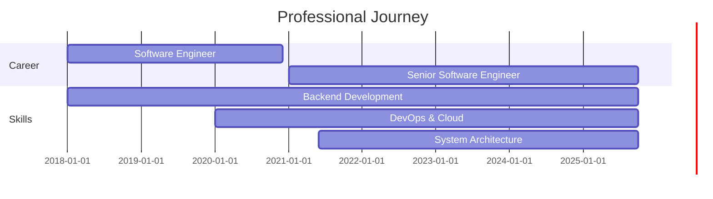

<div align="center">

<!-- Animated Header -->


<!-- Typing SVG -->
<a href="https://git.io/typing-svg"></a>

<br/>

<!-- Social Badges with Animation -->
[](https://sarvarunajvm.github.io/port-react-folio/)
[](mailto:sarvaruna@outlook.com)
[](https://www.linkedin.com/in/saravanan-kalimuthu-01a0a9113)
[](https://twitter.com/persianandro)
[](https://dev.to/sarvarunajvm)

<br/>

<!-- Profile Analytics -->


</div>

---

## 🎯 About Me

```javascript
const saravanan = {
    role: "Senior Software Engineer",
    location: "🌍 Earth",
    code: ["Java", "JavaScript", "Vue.js", "Go", "Python"],
    architecture: ["Clean Architecture", "Microservices", "Domain-Driven Design", "Event-Driven"],
    currentFocus: {
        learning: ["Kubernetes", "Cloud Native", "System Design", "DevOps"],
        building: ["Scalable Backend Systems", "Open Source Tools"],
        writing: ["Technical Blogs", "Documentation", "Best Practices"]
    },
    openSource: {
        maintaining: ["gem-of-config", "gem-of-view"],
        contributing: "Actively contributing to developer tools and frameworks"
    },
    askMeAbout: ["Backend Development", "System Architecture", "DevOps", "Open Source"],
    funFact: "I debug code in my dreams 🌙💻",
    lifePhilosophy: "Code, Learn, Build, Share, Repeat 🔄"
};
```

<div align="center">

### 🎨 Currently Vibing To

[](https://open.spotify.com/user/YOUR_SPOTIFY_ID)

</div>

---

## 🛠️ Tech Arsenal

### 💼 Professional Stack

<div align="center">

<!-- Tech Stack with Icons -->
<table>
<tr>
    <td align="center" width="96">
        
        <br>Java
    </td>
    <td align="center" width="96">
        
        <br>Spring
    </td>
    <td align="center" width="96">
        
        <br>Vue.js
    </td>
    <td align="center" width="96">
        
        <br>JavaScript
    </td>
    <td align="center" width="96">
        
        <br>PostgreSQL
    </td>
    <td align="center" width="96">
        
        <br>Docker
    </td>
    <td align="center" width="96">
        
        <br>Git
    </td>
    <td align="center" width="96">
        
        <br>Linux
    </td>
</tr>
<tr>
    <td align="center" width="96">
        
        <br>HTML5
    </td>
    <td align="center" width="96">
        
        <br>CSS3
    </td>
    <td align="center" width="96">
        
        <br>Gradle
    </td>
    <td align="center" width="96">
        
        <br>IntelliJ
    </td>
    <td align="center" width="96">
        
        <br>VS Code
    </td>
    <td align="center" width="96">
        
        <br>GitHub
    </td>
    <td align="center" width="96">
        
        <br>GitLab
    </td>
    <td align="center" width="96">
        
        <br>SQLite
    </td>
</tr>
</table>

</div>

### 🌱 Learning & Exploring

<div align="center">

<table>
<tr>
    <td align="center" width="96">
        
        <br>Go
    </td>
    <td align="center" width="96">
        
        <br>Python
    </td>
    <td align="center" width="96">
        
        <br>Node.js
    </td>
    <td align="center" width="96">
        
        <br>Kubernetes
    </td>
    <td align="center" width="96">
        
        <br>Nginx
    </td>
    <td align="center" width="96">
        
        <br>AWS
    </td>
    <td align="center" width="96">
        
        <br>GCP
    </td>
    <td align="center" width="96">
        
        <br>Redis
    </td>
</tr>
<tr>
    <td align="center" width="96">
        
        <br>MongoDB
    </td>
    <td align="center" width="96">
        
        <br>Kafka
    </td>
    <td align="center" width="96">
        
        <br>Firebase
    </td>
    <td align="center" width="96">
        
        <br>Sass
    </td>
    <td align="center" width="96">
        
        <br>Actions
    </td>
    <td align="center" width="96">
        
        <br>Jenkins
    </td>
    <td align="center" width="96">
        
        <br>Grafana
    </td>
    <td align="center" width="96">
        
        <br>Prometheus
    </td>
</tr>
</table>

</div>

---

## 📊 GitHub Analytics

<div align="center">

<!-- GitHub Stats Cards -->


<!-- Language Stats -->


<!-- Profile Summary Card -->


</div>

### 📈 Contribution Graphs

<div align="center">

<!-- Activity Graph -->


<!-- 3D Contribution Calendar -->


<!-- Snake Animation -->
<picture>
  <source media="(prefers-color-scheme: dark)" srcset="https://raw.githubusercontent.com/sarvarunajvm/sarvarunajvm/output/github-contribution-grid-snake-dark.svg">
  <source media="(prefers-color-scheme: light)" srcset="https://raw.githubusercontent.com/sarvarunajvm/sarvarunajvm/output/github-contribution-grid-snake.svg">
  
</picture>

</div>

### 🏆 GitHub Trophies

<div align="center">

[](https://github.com/ryo-ma/github-profile-trophy)

</div>

### 📊 Detailed GitHub Metrics

<div align="center">


</div>

---

## ⚡ Coding Activity

<div align="center">

<!-- WakaTime Stats -->
<!--START_SECTION:waka-->
<!--END_SECTION:waka-->

<!-- Coding Stats Card -->


</div>

---

## 📝 Latest Blog Posts

<div align="center">

<!-- BLOG-POST-LIST:START -->
<!-- BLOG-POST-LIST:END -->

[](https://dev.to/sarvarunajvm)

</div>

---

## 🎖️ Achievements & Highlights

<div align="center">

```diff
+ 🏆 Senior Software Engineer with 5+ years of experience
+ 🌟 Active Open Source Maintainer & Contributor
+ ✍️ Technical Writer sharing knowledge with the dev community
+ 🚀 Built and maintained multiple production-grade applications
+ 💡 Passionate about Clean Code, System Design, and Best Practices
+ 🌱 Continuous learner exploring Cloud Native & DevOps ecosystems
```

</div>

---

## 🎯 Open Source Projects

<div align="center">

<!-- Repo Cards -->
<a href="https://github.com/sarvarunajvm/gem-of-config">
  
</a>
<a href="https://github.com/sarvarunajvm/gem-of-view">
  
</a>

</div>

---

## 💼 Experience Timeline



---

## 🤝 Let's Connect & Collaborate

<div align="center">

I'm always excited to connect with fellow developers, collaborate on interesting projects, and discuss technology!

### 📫 How to reach me:

[](mailto:sarvaruna@outlook.com)
[](https://www.linkedin.com/in/saravanan-kalimuthu-01a0a9113)
[](https://twitter.com/persianandro)
[](https://dev.to/sarvarunajvm)
[](https://sarvarunajvm.github.io/port-react-folio/)

<br/>

### 💬 Ask me about:
**Backend Development • System Architecture • DevOps • Open Source • Clean Code • Best Practices**

<br/>

### 🎯 Open for:
**Collaboration • Open Source Contributions • Technical Discussions • Mentorship**

</div>

---

## 💭 Random Dev Quote

<div align="center">


</div>

---

## 🎲 Random Dev Meme

<div align="center">


</div>

---

<div align="center">

### 🌟 Show Some Love!

If you like my work, consider giving a ⭐ to my repositories and following me for more amazing content!


---

### 💡 Fun Fact


---

**✨ "First, solve the problem. Then, write the code." - John Johnson ✨**

<!-- Footer Wave -->


**Thanks for visiting! Let's build something amazing together! 🚀**


</div>
