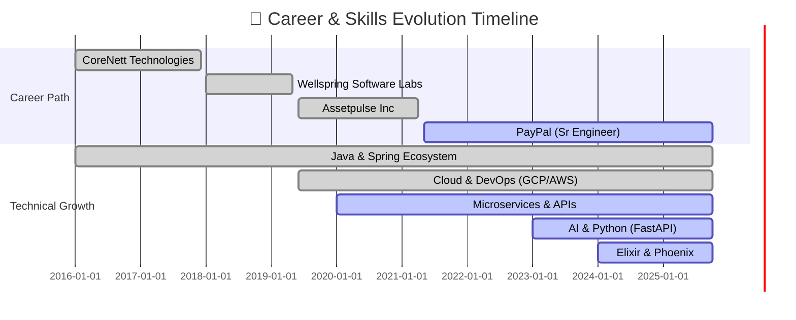

<div align="center">

<!-- Animated Header with Gradient -->


<!-- Dynamic Typing Animation -->
<a href="https://git.io/typing-svg">
  
</a>

<br/>

<!-- Animated Social Badges -->
<p align="center">
  <a href="https://sarvarunajvm.github.io/port-react-folio/">
    
  </a>
  <a href="mailto:sarvaruna@outlook.com">
    
  </a>
  <a href="https://www.linkedin.com/in/saravanan-kalimuthu-01a0a9113">
    
  </a>
  <a href="https://twitter.com/persianandro">
    
  </a>
  <a href="https://dev.to/sarvarunajvm">
    
  </a>
</p>

<!-- Visitor Count & Stats -->
<p align="center">
  
  
  
</p>

</div>

---

## 🎯 About Me

<div align="center">
  
</div>

> **10+ years building reliable web apps and automations that save teams time.** Passionate about open source, privacy-first tools, and crafting developer experiences that spark joy.

<br/>

```typescript
class SeniorSoftwareEngineer {
  constructor() {
    this.name = "Saravanan Kalimuthu";
    this.role = "Senior Software Engineer @ PayPal";
    this.location = "🇮🇳 Chennai, India";
    this.contact = "sarvaruna@outlook.com";
  }

  get skills() {
    return {
      backend: ["Java", "Spring Boot", "Python", "FastAPI", "Elixir", "Phoenix", "Kafka"],
      frontend: ["React", "Vue.js", "TypeScript", "LiveView", "Electron", "Node.js"],
      ai_ml: ["OpenAI CLIP", "PyTorch", "InsightFace", "Tesseract OCR", "MCP"],
      databases: ["PostgreSQL", "SQLite", "Oracle", "Redis", "BigQuery"],
      devOps: ["Docker", "Kubernetes", "GCP", "AWS", "GitHub Actions", "Datadog"]
    };
  }

  get currentRole() {
    return {
      company: "PayPal",
      position: "Senior Software Engineer",
      focus: "Merchant-facing Webhook & Analytics Systems",
      impact: [
        "Webhooks adopted by 10% of merchants",
        "+0.01% revenue impact via real-time analytics",
        "Reduced spam to below 2%",
        "1.5x faster API response optimization"
      ]
    };
  }

  get openSourceActivity() {
    return {
      created: [
        "Ideal Goggles (Privacy-first AI photo search)",
        "Port Advancer (Secure networking tool)"
      ],
      contributed: [
        "Mydia (Media management platform)",
        "Skill Seekers (AI/MCP documentation tool)"
      ]
    };
  }
}

const saravanan = new SeniorSoftwareEngineer();
console.log(saravanan.currentRole.company); // "PayPal"
```

---

## 🛠️ Tech Stack & Skills

<div align="center">

### 💼 Backend & Cloud

<table>
<tr>
  <td align="center" width="100">
    
    <br><strong>Java</strong>
  </td>
  <td align="center" width="100">
    
    <br><strong>Spring</strong>
  </td>
  <td align="center" width="100">
    
    <br><strong>Python</strong>
  </td>
  <td align="center" width="100">
    
    <br><strong>FastAPI</strong>
  </td>
  <td align="center" width="100">
    
    <br><strong>Elixir</strong>
  </td>
  <td align="center" width="100">
    
    <br><strong>Kafka</strong>
  </td>
  <td align="center" width="100">
    
    <br><strong>Docker</strong>
  </td>
  <td align="center" width="100">
    
    <br><strong>K8s</strong>
  </td>
</tr>
<tr>
  <td align="center" width="100">
    
    <br><strong>GCP</strong>
  </td>
  <td align="center" width="100">
    
    <br><strong>AWS</strong>
  </td>
  <td align="center" width="100">
    
    <br><strong>Postgres</strong>
  </td>
  <td align="center" width="100">
    
    <br><strong>Redis</strong>
  </td>
   <td align="center" width="100">
    
    <br><strong>Jenkins</strong>
  </td>
  <td align="center" width="100">
    
    <br><strong>Actions</strong>
  </td>
  <td align="center" width="100">
    
    <br><strong>Grafana</strong>
  </td>
  <td align="center" width="100">
    
    <br><strong>Terraform</strong>
  </td>
</tr>
</table>

### 🎨 Frontend & AI/ML

<table>
<tr>
  <td align="center" width="100">
    
    <br><strong>React</strong>
  </td>
  <td align="center" width="100">
    
    <br><strong>Vue.js</strong>
  </td>
  <td align="center" width="100">
    
    <br><strong>TypeScript</strong>
  </td>
  <td align="center" width="100">
    
    <br><strong>LiveView</strong>
  </td>
  <td align="center" width="100">
    
    <br><strong>Electron</strong>
  </td>
  <td align="center" width="100">
    
    <br><strong>PyTorch</strong>
  </td>
  <td align="center" width="100">
    
    <br><strong>SQLite</strong>
  </td>
  <td align="center" width="100">
    
    <br><strong>Node.js</strong>
  </td>
</tr>
</table>

</div>

---

## 📊 GitHub Statistics

<p align="center">
  
</p>

<p align="center">
  
</p>

<br/>

<p align="center">


</p>

---

## 🔥 Contribution Heatmap & Activity

<div align="center">

<!-- GitHub Activity Graph -->


<br/><br/>

<!-- Contribution Snake Animation -->
<picture>
  <source media="(prefers-color-scheme: dark)" srcset="https://raw.githubusercontent.com/sarvarunajvm/sarvarunajvm/output/github-contribution-grid-snake-dark.svg">
  <source media="(prefers-color-scheme: light)" srcset="https://raw.githubusercontent.com/sarvarunajvm/sarvarunajvm/output/github-contribution-grid-snake-light.svg">
  
</picture>

</div>

---

## 🎯 Featured Projects & Contributions

<div align="center">

<h3>🚀 My Projects</h3>

<table>
  <tr>
    <td width="50%" valign="top">
      <h3>🔍 Ideal Goggles</h3>
      <p><strong>React + Python + Electron</strong></p>
      <p>Privacy-first photo search powered by AI. Runs 100% locally. Features natural language search, face recognition, and OCR for 100K+ photo libraries.</p>
      <a href="https://github.com/sarvarunajvm/ideal-goggles">
        
      </a>
    </td>
    <td width="50%" valign="top">
      <h3>🔧 Port Advancer</h3>
      <p><strong>Node.js CLI</strong></p>
      <p>Secure port forwarding tool for restricted corporate networks. Used daily by 60+ employees to securely access internet resources.</p>
      <a href="https://github.com/sarvarunajvm/port-advancer">
        
      </a>
    </td>
  </tr>
</table>

<h3>🤝 Key Contributions</h3>

<table>
  <tr>
    <td width="50%" valign="top">
      <h3>📺 Mydia</h3>
      <p><strong>Elixir + Phoenix LiveView</strong></p>
      <p>Contributed to this modern, self-hosted media management platform. Worked on unified movies & TV tracking features.</p>
      <a href="https://github.com/getmydia/mydia">
        
      </a>
    </td>
    <td width="50%" valign="top">
      <h3>🧠 Skill Seekers</h3>
      <p><strong>Python + AI/MCP</strong></p>
      <p>Contributed to the MCP Server integration for this tool that converts documentation websites into Claude AI skills.</p>
      <a href="https://github.com/yusufkaraaslan/Skill_Seekers">
        
      </a>
    </td>
  </tr>
</table>

</div>

---

## 💼 Professional Journey



---

## 🎖️ Highlights & Achievements

<div align="center">

```diff
@@                  PayPal Achievements (2021-Present)                  @@

+ 💳 Webhooks Solution → 10% Merchant Adoption Rate
+ 📊 Real-Time Analytics → +0.01% Revenue Impact
+ ⚡ API Performance → 1.5x Speed Improvement
+ 🛡️ Spam Reduction → Below 2%
+ 🎯 Delivery Excellence → 95% On-Time Completion
+ ✅ Code Quality → 70% Coverage with JUnit 5
+ 👥 Scrum Master → 90% Say-Do Ratio

@@                  Assetpulse & Previous Highlights                  @@

+ 🔄 Legacy Modernization → +2% User Engagement (Assetpulse)
+ 💰 BLE vs RFID → 33% Cost Savings (Assetpulse)
+ 🚀 WebSocket Enhancement → +5% Conversion Rate (Assetpulse)
+ 📦 68% Code Coverage Achievement (Assetpulse)
+ ⚡ Response Time → 1200ms to 700ms (Wellspring)
+ 📊 Stakeholder Alignment → 25% Faster (Wellspring)
+ 🔧 RTB Reduction → 10% via Config Systems (CoreNett)

@@                  Open Source & Community                  @@

+ 🔍 Ideal Goggles → Creator: Privacy-first AI Photo Search
+ 📺 Mydia → Contributor: Unified Media Management
+ 🔧 Port Advancer → Creator: Corporate Networking Tool
+ 🎨 vue-embed-gist → Contributor: 270+ Weekly Downloads
+ 🧠 Skill Seekers → Contributor: MCP Integration
```

</div>

---

## 🤝 Let's Connect

<div align="center">

### 💬 I'm always open to:

<table>
  <tr>
    <td align="center" width="25%">
      <br/>
      <b>Collaboration</b><br/>
      <sub>Exciting Projects</sub>
    </td>
    <td align="center" width="25%">
      <br/>
      <b>Open Source</b><br/>
      <sub>Contributing</sub>
    </td>
    <td align="center" width="25%">
      <br/>
      <b>Discussions</b><br/>
      <sub>Tech & Ideas</sub>
    </td>
    <td align="center" width="25%">
      <br/>
      <b>Mentorship</b><br/>
      <sub>Knowledge Sharing</sub>
    </td>
  </tr>
</table>

### 📫 Reach Me:

<p>
  <a href="mailto:sarvaruna@outlook.com">
    
  </a>
  <a href="https://www.linkedin.com/in/saravanan-kalimuthu-01a0a9113">
    
  </a>
  <a href="https://twitter.com/persianandro">
    
  </a>
</p>

<p>
  <a href="https://dev.to/sarvarunajvm">
    
  </a>
  <a href="https://sarvarunajvm.github.io/port-react-folio/">
    
  </a>
</p>

### 🎯 Areas of Expertise:

**Backend Engineering • System Architecture • Cloud Native • DevOps • Microservices • Clean Code**

</div>

---

## 💭 Developer Wisdom

<div align="center">


</div>

---

## 🎲 Fun Corner

<div align="center">

<!-- Dev Joke -->


</div>

---

<div align="center">

### ⭐ Show Some Love!

**If you find my work interesting, consider:**
- ⭐ Starring my repositories
- 👀 Following me for updates
- 🤝 Contributing to my projects
- 💬 Connecting with me

<br/>

---

### 💡 Philosophy

> **"First, solve the problem. Then, write the code."** - John Johnson

> **"Code is like humor. When you have to explain it, it's bad."** - Cory House

---

<!-- Footer Wave Animation -->


**✨ Thanks for visiting! Let's build something amazing together! 🚀**


</div>
