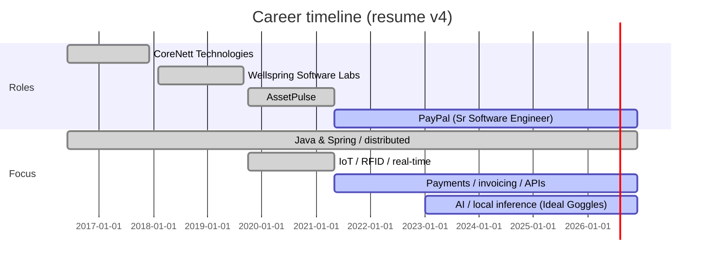

<div align="center">

<!-- Animated Header with Gradient -->


<!-- Dynamic Typing Animation -->
<a href="https://git.io/typing-svg">
  
</a>

<br/>

<!-- Animated Social Badges -->
<p align="center">
  <a href="https://sarvarunajvm.github.io/port-react-folio/">
    
  </a>
  <a href="mailto:sarvaruna@outlook.com">
    
  </a>
  <a href="https://www.linkedin.com/in/saravanan-kalimuthu-01a0a9113">
    
  </a>
  <a href="https://twitter.com/persianandro">
    
  </a>
  <a href="https://dev.to/sarvarunajvm">
    
  </a>
</p>

<!-- Visitor Count & Stats -->
<p align="center">
  
  
  
</p>

</div>

---

## About me

<div align="center">
  
</div>

> **9+ years** shipping distributed systems in **fintech and IoT**. At **PayPal**, I lead architecture end to end — discovery, NFR analysis, phased rollout, and production monitoring — on **merchant-facing invoicing** and **email/URL whitelabeling**. I connect design choices to **availability, throughput, fraud reduction, and merchant adoption**.

<br/>

```typescript
class SeniorSoftwareEngineer {
  constructor() {
    this.name = "Saravanan Kalimuthu";
    this.role = "Senior Software Engineer @ PayPal";
    this.location = "🇮🇳 Chennai, India";
    this.contact = "sarvaruna@outlook.com";
  }

  get skills() {
    return {
      languages: ["Java", "Python", "JavaScript", "TypeScript", "SQL"],
      backend: ["Spring Boot", "JAX-RS", "FastAPI", "Kafka", "Drools", "WebSockets"],
      frontend: ["React 19", "Vue.js", "TypeScript", "Electron", "Konva"],
      data: ["PostgreSQL", "Oracle", "Redis", "SQLite", "BigQuery"],
      observability: ["Datadog", "Splunk", "OpenTelemetry", "Micrometer"],
      cloud: ["AWS", "GCP", "Docker", "Jenkins", "GitHub Actions"]
    };
  }

  get currentRole() {
    return {
      company: "PayPal",
      position: "Senior Software Engineer",
      team: "Invoicing & Communications Platform",
      impact: [
        "Service availability 99.56% → 99.96% (daily health digest)",
        "Invoice aggregation rollout — 0 P1 incidents",
        "Webhook delivery — ~10% merchant adoption",
        "Spam on invoicing APIs — <2%",
        "Invoice read path — p99 ~1.5× faster (Redis + query redesign)",
        "Test coverage ~40% → 70% (contracts + mutation testing)",
        "Release cadence — 95% on-time; Scrum quarter — 90% Say-Do"
      ]
    };
  }

  get openSourceActivity() {
    return {
      created: [
        "Ideal Goggles — privacy-first local AI photo search",
        "Port-Advancer — port-forward / reverse proxy for restricted networks",
        "utils-commons — Java utilities (Apache Commons–style)"
      ],
      contributed: ["vue-embed-gist — Vue OSS component"]
    };
  }
}

const saravanan = new SeniorSoftwareEngineer();
console.log(saravanan.currentRole.company); // "PayPal"
```

---

## Tech stack & skills

<div align="center">

### Backend & cloud

<table>
<tr>
  <td align="center" width="100">
    
    <br><strong>Java</strong>
  </td>
  <td align="center" width="100">
    
    <br><strong>Spring</strong>
  </td>
  <td align="center" width="100">
    
    <br><strong>Python</strong>
  </td>
  <td align="center" width="100">
    
    <br><strong>FastAPI</strong>
  </td>
  <td align="center" width="100">
    
    <br><strong>Kafka</strong>
  </td>
  <td align="center" width="100">
    
    <br><strong>Docker</strong>
  </td>
  <td align="center" width="100">
    
    <br><strong>Node.js</strong>
  </td>
  <td align="center" width="100">
    
    <br><strong>Jenkins</strong>
  </td>
</tr>
<tr>
  <td align="center" width="100">
    
    <br><strong>GCP</strong>
  </td>
  <td align="center" width="100">
    
    <br><strong>AWS</strong>
  </td>
  <td align="center" width="100">
    
    <br><strong>Postgres</strong>
  </td>
  <td align="center" width="100">
    
    <br><strong>Redis</strong>
  </td>
  <td align="center" width="100">
    
    <br><strong>Actions</strong>
  </td>
</tr>
</table>

### Frontend & AI/ML

<table>
<tr>
  <td align="center" width="100">
    
    <br><strong>React</strong>
  </td>
  <td align="center" width="100">
    
    <br><strong>Vue.js</strong>
  </td>
  <td align="center" width="100">
    
    <br><strong>TypeScript</strong>
  </td>
  <td align="center" width="100">
    
    <br><strong>Electron</strong>
  </td>
  <td align="center" width="100">
    
    <br><strong>PyTorch</strong>
  </td>
  <td align="center" width="100">
    
    <br><strong>SQLite</strong>
  </td>
</tr>
</table>

**Also:** Spring Data JPA, Hibernate, JAX-RS, Maven, Gradle, Drools (KIE), Chronicle Queue, AMQ, REST/OAS, OAuth2/JWT, Oracle, BigQuery, BigTable, Traefik, Artifactory, Datadog, Splunk, OpenTelemetry, Impinj RFID (OctaneSDK), CLIP, InsightFace, Tesseract, DKIM/SPF/DMARC, OWASP, SonarQube, JaCoCo.

</div>

---

## GitHub statistics

<p align="center">
  
</p>

<p align="center">
  
</p>

<br/>

<div align="center">
  
</div>

---

## Contribution heatmap & activity

<div align="center">


<br/><br/>

<picture>
  <source media="(prefers-color-scheme: dark)" srcset="https://raw.githubusercontent.com/sarvarunajvm/sarvarunajvm/output/github-contribution-grid-snake-dark.svg">
  <source media="(prefers-color-scheme: light)" srcset="https://raw.githubusercontent.com/sarvarunajvm/sarvarunajvm/output/github-contribution-grid-snake-light.svg">
  
</picture>

</div>

---

## GitHub streak

<div align="center">


</div>

---

## Featured projects

<div align="center">

<h3>Projects</h3>

<table>
  <tr>
    <td width="50%" valign="top">
      <h3>Ideal Goggles</h3>
      <p><strong>Electron · React 19 · FastAPI · Python · PyTorch</strong></p>
      <p>Privacy-first desktop photo manager — inference runs locally. NL search, InsightFace, OCR (Tesseract), duplicate detection over <strong>100k+</strong> photos with sub-2s search. CI/CD on GitHub Actions + Codecov.</p>
      <a href="https://github.com/sarvarunajvm/ideal-goggles">
        
      </a>
    </td>
    <td width="50%" valign="top">
      <h3>Port-Advancer</h3>
      <p><strong>Node.js</strong></p>
      <p>Internal tool for port-forwarding and reverse proxying on restricted corporate networks — used by <strong>60+</strong> engineers.</p>
      <a href="https://github.com/sarvarunajvm/port-advancer">
        
      </a>
    </td>
  </tr>
  <tr>
    <td width="50%" valign="top">
      <h3>utils-commons</h3>
      <p><strong>Java</strong></p>
      <p>General-purpose utilities (String, Number, Date, collections, BLOB, Zip) inspired by Apache Commons IO.</p>
      <a href="https://github.com/sarvarunajvm/utils-commons">
        
      </a>
    </td>
    <td width="50%" valign="top">
      <h3>vue-embed-gist</h3>
      <p><strong>Vue · OSS contribution</strong></p>
      <p>Contribution to a Vue component for embedding Gists — <strong>270+</strong> weekly npm downloads.</p>
      <a href="https://github.com/sudhanshu-15/vue-embed-gist/pull/13">
        
      </a>
    </td>
  </tr>
</table>

</div>

---

## Professional journey


```mermaid
gantt
    title Career timeline (resume v4)
    dateFormat YYYY-MM
    section Roles
    CoreNett Technologies       :done, 2016-06, 2017-12
    Wellspring Software Labs      :done, 2018-02, 2019-09
    AssetPulse                    :done, 2019-10, 2021-05
    PayPal (Sr Software Engineer) :active, 2021-05, 2026-12
    section Focus
    Java & Spring / distributed   :done, 2016-06, 2026-12
    IoT / RFID / real-time        :done, 2019-10, 2021-05
    Payments / invoicing / APIs   :active, 2021-05, 2026-12
    AI / local inference (Ideal Goggles) :active, 2023-01, 2026-12
```

---

## Highlights (source: resume v4)

<div align="center">

```diff
@@ PayPal — Invoicing & Communications Platform (2021–present) @@

+ Email & URL whitelabeling — discovery → ADR, DKIM/SPF/DMARC, staging plans
+ Invoice aggregation — phased rollout 5%→GA, 0 P1 incidents
+ Availability — 99.56% → 99.96% via automated daily health digest
+ API governance — progressive access ramp + fraud signals; spam <2% on APIs
+ Webhooks — at-least-once, dedup, fan-out; ~10% merchant adoption
+ Performance — N+1 fix + Redis; p99 ~1.5× under peak
+ Quality — contracts + mutation testing; coverage ~40% → 70%
+ Delivery — 95% on-time releases; Scrum quarter 90% Say-Do

@@ AssetPulse — RFID / IoT (2019–2021) @@

+ BLE vs RFID — 33% hardware cost reduction
+ Spring Boot + Chronicle Queue + Drools rule engine; Vue + Konva floor maps
+ Plugin architecture for hardware; mock RFID layer — 68% coverage on hot paths

@@ Wellspring — ERP (2018–2019) @@

+ API latency — ~1200ms → ~700ms via batching & connections
+ C4 diagrams — ~25% faster design review cycles

@@ CoreNett — CRM (2016–2017) @@

+ Reporting — ~30% faster report generation (pagination)
```

</div>

---

## Education

| Degree | Institution | Period | Notes |
|--------|-------------|--------|--------|
| **MCA** | University of Madras | 2016–2019 | CGPA 6.48 — thesis: cloud secure storage, double-key encryption |
| **BCA** | Gurunanak College | 2011–2014 | CGPA 6.24 — internal exam web app; National Honor Society |

---

## Let's connect

<div align="center">

### I'm open to

<table>
  <tr>
    <td align="center" width="25%">
      <br/>
      <b>Collaboration</b><br/>
      <sub>Interesting projects</sub>
    </td>
    <td align="center" width="25%">
      <br/>
      <b>Open source</b><br/>
      <sub>Contributing</sub>
    </td>
    <td align="center" width="25%">
      <br/>
      <b>Discussions</b><br/>
      <sub>Tech & ideas</sub>
    </td>
    <td align="center" width="25%">
      <br/>
      <b>Mentorship</b><br/>
      <sub>Knowledge sharing</sub>
    </td>
  </tr>
</table>

### Reach me

📞 +91 979-087-0737 · 📧 [sarvaruna@outlook.com](mailto:sarvaruna@outlook.com)

<p>
  <a href="mailto:sarvaruna@outlook.com">
    
  </a>
  <a href="https://www.linkedin.com/in/saravanan-kalimuthu-01a0a9113">
    
  </a>
  <a href="https://twitter.com/persianandro">
    
  </a>
</p>

<p>
  <a href="https://dev.to/sarvarunajvm">
    
  </a>
  <a href="https://sarvarunajvm.github.io/port-react-folio/">
    
  </a>
  <a href="https://github.com/sarvarunajvm">
    
  </a>
</p>

**Focus areas:** system design · NFR analysis · distributed systems · event-driven & plugin architectures · phased rollout · payments & platform reliability

</div>

---

## Developer wisdom

<div align="center">


</div>

---

## Fun corner

<div align="center">


</div>

---

<div align="center">

### Show some love

**If you find my work useful:**
- Star repositories you use
- Follow for updates
- Contribute or open issues
- Connect on LinkedIn or email

<br/>

---

### Philosophy

> **"First, solve the problem. Then, write the code."** — John Johnson

> **"Code is like humor. When you have to explain it, it's bad."** — Cory House

---


**Thanks for visiting.**


</div>
