<div align="center">

<!-- Animated Header with Gradient -->


<!-- Dynamic Typing Animation -->
<a href="https://git.io/typing-svg">
  
</a>

<br/>

<!-- Animated Social Badges -->
<p align="center">
  <a href="https://sarvarunajvm.github.io/port-react-folio/">
    
  </a>
  <a href="mailto:sarvaruna@outlook.com">
    
  </a>
  <a href="https://www.linkedin.com/in/saravanan-kalimuthu-01a0a9113">
    
  </a>
  <a href="https://twitter.com/persianandro">
    
  </a>
  <a href="https://dev.to/sarvarunajvm">
    
  </a>
</p>

<!-- Enhanced Analytics Badges -->
<p align="center">
  
  
  
  
</p>

</div>

---

## 🎯 About Me

<div align="center">
  
</div>

<br/>

```typescript
class SeniorSoftwareEngineer {
  constructor() {
    this.name = "Saravanan Kalimuthu";
    this.role = "Senior Software Engineer @ PayPal";
    this.experience = "8+ years in Java development";
    this.location = "🇮🇳 India";
    this.contactMe = "sarvaruna@outlook.com";
  }

  get skills() {
    return {
      backend: [
        "Java", "Spring Boot", "Spring Security", "Spring REST",
        "JAX-RS", "SOAP", "WebSockets", "Hibernate/JPA", "Maven", "Gradle"
      ],
      frontend: [
        "Node.js", "Vue.js", "React.js", "HTML5/CSS3", "Vuex", "Redux"
      ],
      databases: ["Oracle", "PostgreSQL", "H2", "Redis", "BigQuery", "BigTable"],
      devOps: [
        "Jenkins", "GitHub Actions", "Docker", "Google Cloud", "AWS",
        "Otel", "Micrometer", "Splunk", "Datadog"
      ],
      testing: ["JUnit", "Mockito", "Jest", "Cypress"],
      tools: ["Git", "JIRA", "Confluence", "AMQ/Kafka", "OAuth2", "JWT", "SonarQube"]
    };
  }

  get currentRole() {
    return {
      company: "PayPal",
      position: "Senior Software Engineer",
      duration: "May 2021 - Present",
      impact: [
        "Webhooks solution → adopted by 10% of merchants",
        "Near-real-time analytics → 0.01% revenue increase",
        "API performance optimization → 1.5x faster response",
        "Spam reduction → below 2%",
        "95% on-time delivery rate",
        "70% code coverage with JUnit 5",
        "Scrum Master → 90% Say-Do ratio"
      ]
    };
  }

  get openSourceContributions() {
    return {
      "utils-commons": "Java utilities (Apache Commons inspired)",
      "port-advancer": "Network tool used by 60+ employees",
      "vue-embed-gist": "270+ weekly downloads on NPM"
    };
  }

  get expertise() {
    return [
      "Scalable Enterprise Applications",
      "Microservices & Event-Driven Architecture",
      "SOLID Principles & Design Patterns",
      "Performance Optimization & Caching",
      "Test-Driven Development",
      "Database Optimization"
    ];
  }

  get summary() {
    return "Results-oriented engineer with 8+ years building scalable enterprise apps. Proven track record of delivering measurable business impact through technical excellence and innovation.";
  }
}

const saravanan = new SeniorSoftwareEngineer();
console.log(saravanan.currentRole.company); // "PayPal"
```

---

## 🛠️ Tech Stack & Skills

<div align="center">

### 💼 Core Technologies

<table>
<tr>
  <td align="center" width="100">
    
    <br><strong>Java</strong>
  </td>
  <td align="center" width="100">
    
    <br><strong>Spring</strong>
  </td>
  <td align="center" width="100">
    
    <br><strong>JavaScript</strong>
  </td>
  <td align="center" width="100">
    
    <br><strong>TypeScript</strong>
  </td>
  <td align="center" width="100">
    
    <br><strong>Vue.js</strong>
  </td>
  <td align="center" width="100">
    
    <br><strong>Docker</strong>
  </td>
  <td align="center" width="100">
    
    <br><strong>Kubernetes</strong>
  </td>
  <td align="center" width="100">
    
    <br><strong>AWS</strong>
  </td>
</tr>
<tr>
  <td align="center" width="100">
    
    <br><strong>PostgreSQL</strong>
  </td>
  <td align="center" width="100">
    
    <br><strong>MongoDB</strong>
  </td>
  <td align="center" width="100">
    
    <br><strong>Redis</strong>
  </td>
  <td align="center" width="100">
    
    <br><strong>GitHub</strong>
  </td>
  <td align="center" width="100">
    
    <br><strong>GitLab</strong>
  </td>
  <td align="center" width="100">
    
    <br><strong>Node.js</strong>
  </td>
  <td align="center" width="100">
    
    <br><strong>Go</strong>
  </td>
  <td align="center" width="100">
    
    <br><strong>Python</strong>
  </td>
</tr>
</table>

### 🚀 DevOps & Cloud

<table>
<tr>
  <td align="center" width="100">
    
    <br><strong>Nginx</strong>
  </td>
  <td align="center" width="100">
    
    <br><strong>Kafka</strong>
  </td>
  <td align="center" width="100">
    
    <br><strong>Jenkins</strong>
  </td>
  <td align="center" width="100">
    
    <br><strong>Actions</strong>
  </td>
  <td align="center" width="100">
    
    <br><strong>Grafana</strong>
  </td>
  <td align="center" width="100">
    
    <br><strong>Prometheus</strong>
  </td>
  <td align="center" width="100">
    
    <br><strong>GCP</strong>
  </td>
  <td align="center" width="100">
    
    <br><strong>Terraform</strong>
  </td>
</tr>
</table>

### 🎨 Frontend & Tools

<table>
<tr>
  <td align="center" width="100">
    
    <br><strong>React</strong>
  </td>
  <td align="center" width="100">
    
    <br><strong>HTML5</strong>
  </td>
  <td align="center" width="100">
    
    <br><strong>CSS3</strong>
  </td>
  <td align="center" width="100">
    
    <br><strong>Sass</strong>
  </td>
  <td align="center" width="100">
    
    <br><strong>Tailwind</strong>
  </td>
  <td align="center" width="100">
    
    <br><strong>VS Code</strong>
  </td>
  <td align="center" width="100">
    
    <br><strong>IntelliJ</strong>
  </td>
  <td align="center" width="100">
    
    <br><strong>GraphQL</strong>
  </td>
</tr>
</table>

</div>

---

## 📊 GitHub Statistics

<div align="center">

<!-- GitHub Stats with Custom Theme -->


<!-- Language Stats with Better Styling -->


</div>

---

## 🔥 Contribution Heatmap & Activity

<div align="center">

<!-- GitHub Activity Graph -->


<br/><br/>

<!-- Contribution Snake Animation -->
<picture>
  <source media="(prefers-color-scheme: dark)" srcset="https://raw.githubusercontent.com/sarvarunajvm/sarvarunajvm/output/github-contribution-grid-snake-dark.svg">
  <source media="(prefers-color-scheme: light)" srcset="https://raw.githubusercontent.com/sarvarunajvm/sarvarunajvm/output/github-contribution-grid-snake-light.svg">
  
</picture>

</div>

---

## 🏆 GitHub Achievements

<div align="center">

<!-- Trophy Showcase -->


<!-- Metrics Summary Cards -->


</div>

---

## 🎯 Featured Projects

<div align="center">

### Open Source Contributions

<table>
  <tr>
    <td width="50%" valign="top">
      <h3>📦 Utils-Commons</h3>
      <p><strong>Java</strong> | Utility Library</p>
      <p>Inspired by Apache Commons IO, this library provides utilities for String, Number, Date, Set, List, BLOB, and Zip operations.</p>
      <a href="https://github.com/sarvarunajvm/utils-commons">
        
      </a>
    </td>
    <td width="50%" valign="top">
      <h3>🔧 Port-Advancer</h3>
      <p><strong>Node.js</strong> | DevOps Tool</p>
      <p>User-friendly tool enabling 60+ employees to perform port forwarding and reverse proxying for secure internet access within restricted networks.</p>
      <a href="https://github.com/sarvarunajvm/port-advancer">
        
      </a>
    </td>
  </tr>
  <tr>
    <td width="50%" valign="top">
      <h3>🎨 vue-embed-gist</h3>
      <p><strong>JavaScript/Vue</strong> | Component Library</p>
      <p>Contributor to open-source project averaging <strong>270 downloads per week</strong> on NPM.</p>
      <a href="https://github.com/sudhanshu-15/vue-embed-gist/pull/13">
        
      </a>
      <a href="http://goo.gl/Hjkx2j">
        
      </a>
    </td>
    <td width="50%" valign="top">
      <h3>📂 More Projects</h3>
      <p>Explore additional repositories and contributions</p>
      <a href="https://github.com/sarvarunajvm?tab=repositories">
        
      </a>
    </td>
  </tr>
</table>

</div>

---

## 📝 Latest Blog Posts

<div align="center">

<!-- BLOG-POST-LIST:START -->
<!-- BLOG-POST-LIST:END -->

<a href="https://dev.to/sarvarunajvm">
  
</a>

</div>

---

## 💼 Professional Journey

```mermaid
gantt
    title 🚀 Career & Skills Evolution Timeline
    dateFormat YYYY-MM
    section Career Path
    CoreNett Technologies       :done, 2016-06, 2017-12
    Wellspring Software Labs    :done, 2018-02, 2019-09
    Assetpulse Inc             :done, 2019-10, 2021-05
    PayPal (Sr Engineer)       :active, 2021-05, 2025-10
    section Education
    BCA - Gurunanak College    :done, 2011-01, 2014-12
    MCA - University of Madras :done, 2016-01, 2019-12
    section Technical Growth
    Java & Spring Ecosystem    :done, 2016-06, 2025-10
    Cloud & DevOps (GCP/AWS)   :done, 2019-10, 2025-10
    Microservices & APIs       :active, 2020-01, 2025-10
    Performance Optimization   :active, 2021-05, 2025-10
```



---

## 🎖️ Highlights & Achievements

<div align="center">

```diff
@@                  PayPal Achievements (2021-Present)                  @@

+ 💳 Webhooks Solution → 10% Merchant Adoption Rate
+ 📊 Real-Time Analytics → 0.01% Revenue Growth
+ ⚡ API Performance → 1.5x Speed Improvement
+ 🛡️ Spam Reduction → Below 2% Success
+ 🎯 Delivery Excellence → 95% On-Time Completion
+ ✅ Code Quality → 70% Coverage with JUnit 5
+ 👥 Scrum Master → 90% Say-Do Ratio

@@                  Prior Experience Highlights                  @@

+ 🔄 Legacy Modernization → 2% Engagement Boost (Assetpulse)
+ 💰 BLE vs RFID → 33% Cost Savings (Assetpulse)
+ 🚀 WebSocket Enhancement → 5% Conversion Rate (Assetpulse)
+ 📦 68% Code Coverage Achievement (Assetpulse)
+ ⚡ Response Time → 1200ms to 700ms (Wellspring)
+ 📊 Stakeholder Alignment → 25% Faster (Wellspring)
+ 📈 Report Performance → 30% Improvement (CoreNett)
+ 🔧 RTB Reduction → 10% via Config Systems (CoreNett)

@@                  Open Source & Education                  @@

+ 🌟 8+ Years Java Development Expertise
+ 📦 Utils-Commons → Apache Commons Inspired
+ 🔧 Port-Advancer → Used by 60+ Employees
+ 🎨 vue-embed-gist → 270+ Weekly NPM Downloads
+ 🎓 MCA → University of Madras (2016-2019)
+ 🎓 BCA → Gurunanak College (2011-2014)
```

</div>

---

## 🎨 Skills Proficiency

<div align="center">

```text
Backend Development    ████████████████████   100%
System Architecture    ██████████████████░░    90%
Cloud & DevOps        ██████████████████░░    90%
Microservices         █████████████████░░░    85%
Frontend Development  ████████████████░░░░    80%
Database Design       ████████████████░░░░    80%
Docker & Kubernetes   ███████████████░░░░░    75%
System Design         ███████████████░░░░░    75%
```

</div>

---

## 🤝 Let's Connect

<div align="center">

### 💬 I'm always open to:

<table>
  <tr>
    <td align="center" width="25%">
      <br/>
      <b>Collaboration</b><br/>
      <sub>Exciting Projects</sub>
    </td>
    <td align="center" width="25%">
      <br/>
      <b>Open Source</b><br/>
      <sub>Contributing</sub>
    </td>
    <td align="center" width="25%">
      <br/>
      <b>Discussions</b><br/>
      <sub>Tech & Ideas</sub>
    </td>
    <td align="center" width="25%">
      <br/>
      <b>Mentorship</b><br/>
      <sub>Knowledge Sharing</sub>
    </td>
  </tr>
</table>

### 📫 Reach Me:

<p>
  <a href="mailto:sarvaruna@outlook.com">
    
  </a>
  <a href="https://www.linkedin.com/in/saravanan-kalimuthu-01a0a9113">
    
  </a>
  <a href="https://twitter.com/persianandro">
    
  </a>
</p>

<p>
  <a href="https://dev.to/sarvarunajvm">
    
  </a>
  <a href="https://sarvarunajvm.github.io/port-react-folio/">
    
  </a>
</p>

### 🎯 Areas of Expertise:

**Backend Engineering • System Architecture • Cloud Native • DevOps • Microservices • Clean Code**

</div>

---

## 💭 Developer Wisdom

<div align="center">


</div>

---

## 🎲 Fun Corner

<div align="center">

<!-- Dev Joke -->


</div>

---

<div align="center">

### ⭐ Show Some Love!

**If you find my work interesting, consider:**
- ⭐ Starring my repositories
- 👀 Following me for updates
- 🤝 Contributing to my projects
- 💬 Connecting with me

<br/>

---

### 💡 Philosophy

> **"First, solve the problem. Then, write the code."** - John Johnson

> **"Code is like humor. When you have to explain it, it's bad."** - Cory House

---

<!-- Footer Wave Animation -->


**✨ Thanks for visiting! Let's build something amazing together! 🚀**


</div>
